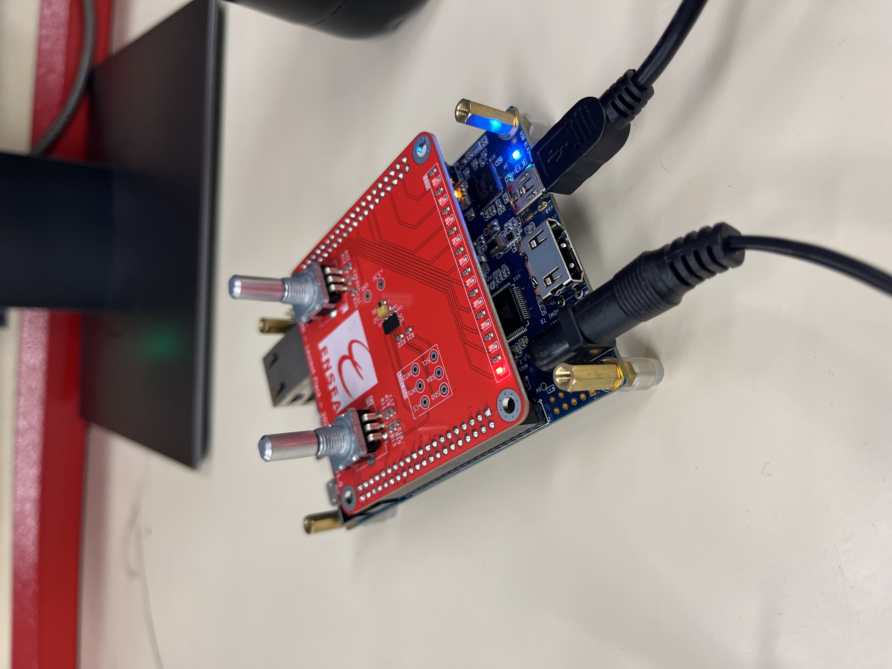
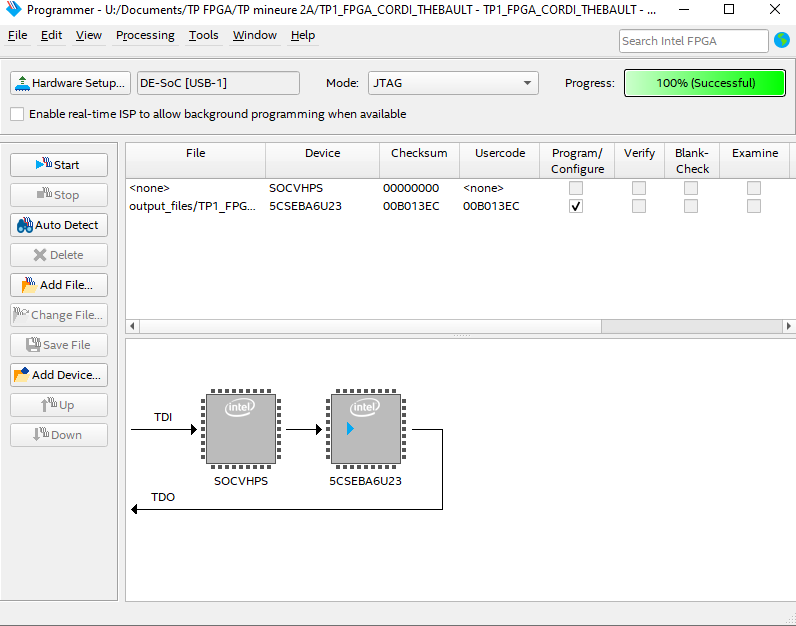
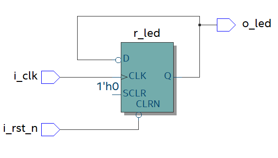

# 🎓 TP de FPGA

## 👥 Équipe

| Nom | Prénom | Groupe |
|:--|:--|:--:|
| THÉBAULT | [Nelven](https://github.com/NelvTheb) | ESE TP1 |
| CORDI | [Hugo](https://github.com/Lynxlegrand) | ESE TP1 |

🏫 **ENSEA — 3A ESE**  
👨‍🏫 **Encadrants :** [L.Fiack](https://github.com/lfiack)  et  [N.Papazoglou](https://github.com/lfiack)

---

## TOC
- [👥 Équipe](#-équipe)
- [🎯 Objectifs du TP](#-objectifs-du-tp)
- [1.1 Création du projet](#11-création-du-projet)
- [1.2 Faire clignoter une LED](#12-faire-clignoter-une-led)
- [1.3 Chenillard](#13-chenillard)
- [2. Petit projet : Écran Magique](#2-petit-projet--écran-magique)
- [2.1 Gestion des encodeurs](#21-gestion-des-encodeurs)
- [2.2 Comment visualiser la sortie HDMI ?](#22-comment-visualiser-la-sortie-hdmi-)
- [2.3 Contrôleur HDMI](#23-contrôleur-hdmi)
- [2.4 Déplacement d'un pixel](#24-déplacement-dun-pixel)
- [2.5 Mémorisation](#25-mémorisation)
- [2.6 Effacement](#26-effacement)


# 🎯 Objectif du TP

- Apprendre à créer et configurer un projet FPGA avec **Quartus Prime**.  
- Comprendre l’utilisation du **Pin Planner** et la gestion des E/S (LEDs, boutons, encodeurs).  
- Synthétiser et programmer un design VHDL sur la carte via **USB Blaster II**.  
- Manipuler des blocs de base : clignotement, chenillard, déplacement et mémorisation d’un pixel.  
- Introduire les principes nécessaires à l'affichage vidéo (**HDMI**).

---

# 1. Démarrage

## 1.1 Création du projet
La première étape consiste à créer un nouveau projet dans Quartus Prime. Il faut choisir un nom sans espaces ni caractères spéciaux, sélectionner le FPGA cible (modèle 5CSEBA6U23I7) et configurer un projet vide. Cette préparation est essentielle pour organiser correctement les fichiers VHDL et faciliter la compilation et la programmation ultérieures.




On configure le Soc du FPGA pour téléverser la description matérielle. 





## 1.2 Faire clignoter une LED

1. Plusieurs horloges sont disponibles sur la carte. Sur quelle broche est connectée l’horloge nommée FPGA_CLK1_50 ?

2. Code pour faire clignoter la LED : 


```VHDL
library ieee;
use ieee.std_logic_1164.all;

entity TP1_FPGA_CORDI_THEBAULT is
    port (
        i_clk : in std_logic;
        i_rst_n : in std_logic;
        o_led : out std_logic
    );
end entity TP1_FPGA_CORDI_THEBAULT;

architecture rtl of TP1_FPGA_CORDI_THEBAULT is
    signal r_led : std_logic := '0';
begin
	process(i_clk, i_rst_n)
		variable counter : natural range 0 to 5000000 := 0;
	begin
		 if (i_rst_n = '0') then
			  counter := 0;
			  r_led_enable <= '0';
		 elsif (rising_edge(i_clk)) then
			  if (counter = 12500000) then -- 0.25 s x 50 000 000 = 12 500 000 cycles d'horloges (clignote à 2Hz)
					counter := 0;
					r_led_enable <= '1';
			  else
					counter := counter + 1;
					r_led_enable <= '0';
			  end if;
		 end if;
	end process;
    o_led <= r_led;
end architecture rtl;
```

3. Schémas correspondant au code VHDL :




Au final : 

```VHDL

library ieee;
use ieee.std_logic_1164.all;

entity TP1_FPGA_CORDI_THEBAULT is
    port (
        i_clk : in std_logic;
        i_rst_n : in std_logic;
        o_led : out std_logic
    );
end entity TP1_FPGA_CORDI_THEBAULT;

architecture rtl of TP1_FPGA_CORDI_THEBAULT is
    signal counter : natural := 0;
    signal r_led   : std_logic := '0';
begin
    process(i_clk, i_rst_n)
    begin
        if (i_rst_n = '0') then
            counter <= 0;
            r_led   <= '0';

        elsif rising_edge(i_clk) then
            if counter = 12500000 then  -- 0.25 s x 50 000 000 = 12 500 000 cycles d'horloges (clignote à 2Hz)
                counter <= 0;
                r_led   <= not r_led;     -- on inverse la LED
            else
                counter <= counter + 1;
            end if;
        end if;
    end process;

    o_led <= r_led;
end architecture;

```


## 1.3 Chenillard

<video src="vid/2.mp4" controls></video>


https://github.com/user-attachments/assets/f6c4f2c6-4612-4acd-bf6a-1028251381b8


# 2. Petit projet : Ecran Magique 

## 2.1 Gestion des encodeurs

## 2.2 Comment visualiser la sortie HDMI ?

## 2.3 Contrôleur HDMI

## 2.4 Déplacement d'un pixel

## 2.5 Mémorisation

## 2.6 Effacement


