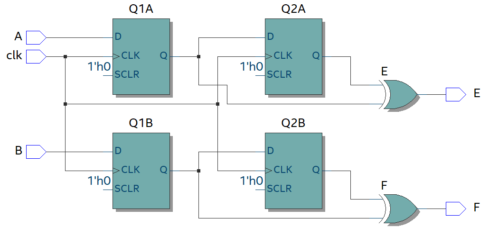
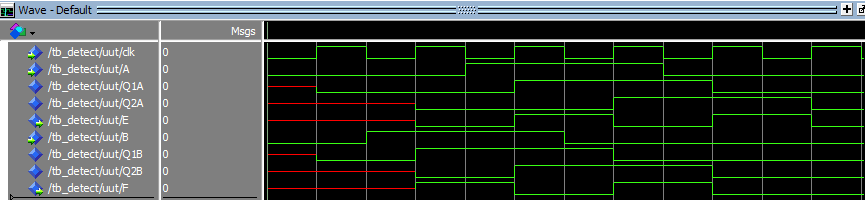
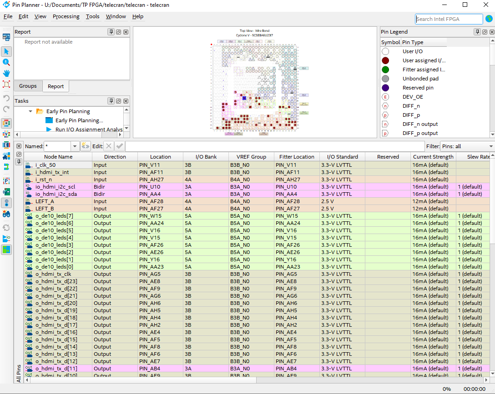
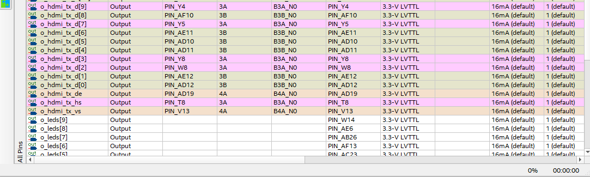
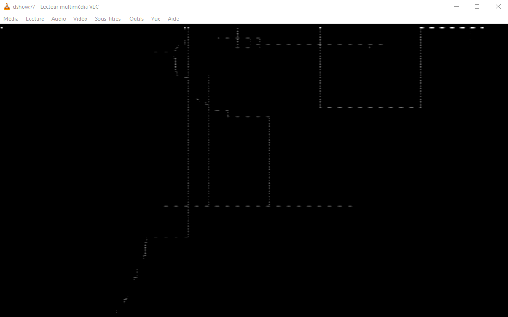
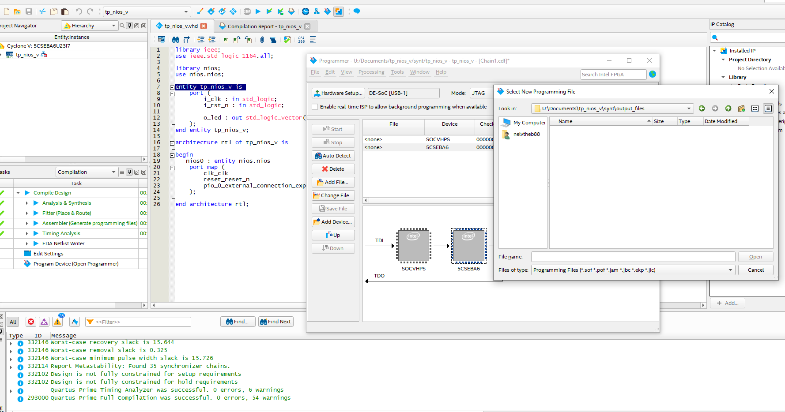
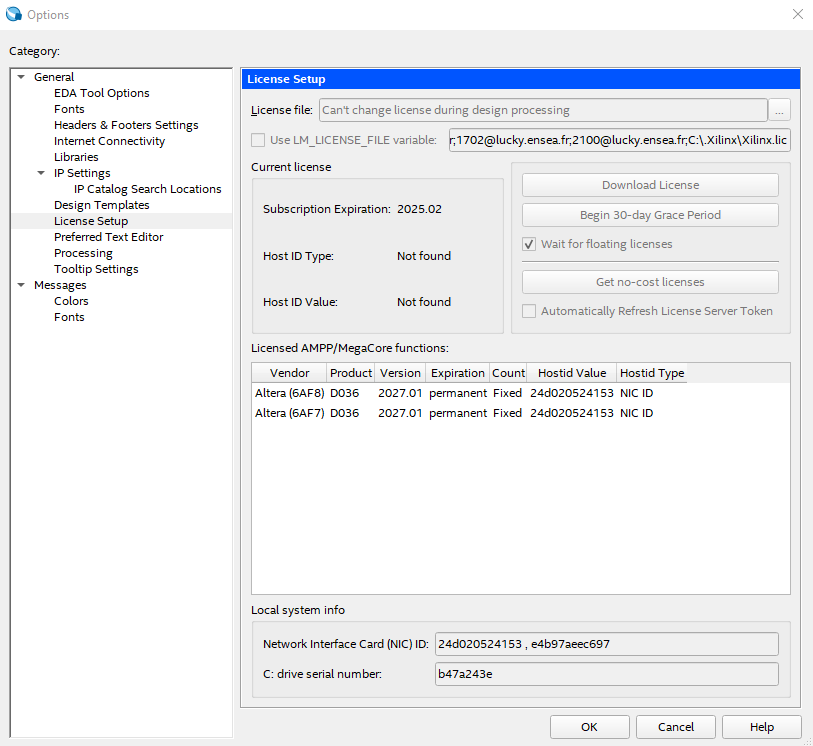
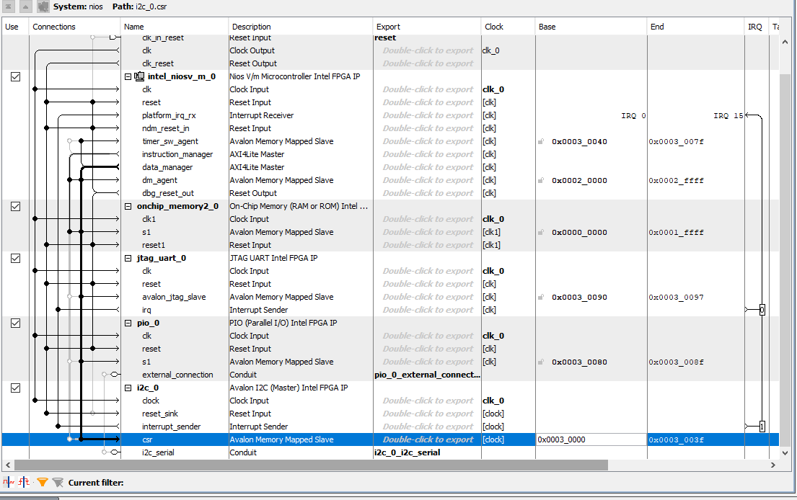

# 🎓 TP de FPGA

## 👥 Équipe

| Nom | Prénom | Groupe |
|:--|:--|:--:|
| THÉBAULT | [Nelven](https://github.com/NelvTheb) | ESE TP1 |
| CORDI | [Hugo](https://github.com/Lynxlegrand) | ESE TP1 |

🏫 **ENSEA — 3A ESE**  
👨‍🏫 **Encadrants :** [L.Fiack](https://github.com/lfiack)  et  [N.Papazoglou](https://github.com/lfiack)

---

## TOC
- [👥 Équipe](#-équipe)
- [🎯 Objectifs du TP](#-objectifs-du-tp)
- [1.1 Création du projet](#11-création-du-projet)
- [1.2 Faire clignoter une LED](#12-faire-clignoter-une-led)
- [1.3 Chenillard](#13-chenillard)
- [2. Petit projet : Écran Magique](#2-petit-projet--écran-magique)
- [2.1 Gestion des encodeurs](#21-gestion-des-encodeurs)
- [2.2 Comment visualiser la sortie HDMI ?](#22-comment-visualiser-la-sortie-hdmi-)
- [2.3 Contrôleur HDMI](#23-contrôleur-hdmi)
- [2.4 Déplacement d'un pixel](#24-déplacement-dun-pixel)
- [2.5 Mémorisation](#25-mémorisation)
- [2.6 Effacement](#26-effacement)
- [3 FPGA avancé](#3-FPGA-avancé)


# 🎯 Objectif du TP

- Apprendre à créer et configurer un projet FPGA avec **Quartus Prime**.  
- Comprendre l’utilisation du **Pin Planner** et la gestion des E/S (LEDs, boutons, encodeurs).  
- Synthétiser et programmer un design VHDL sur la carte via **USB Blaster II**.  
- Manipuler des blocs de base : clignotement, chenillard, déplacement et mémorisation d’un pixel.  
- Introduire les principes nécessaires à l'affichage vidéo (**HDMI**).

---

# 1. Démarrage

## 1.1 Création du projet
La première étape consiste à créer un nouveau projet dans Quartus Prime. Il faut choisir un nom sans espaces ni caractères spéciaux, sélectionner le FPGA cible (modèle 5CSEBA6U23I7) et configurer un projet vide. Cette préparation est essentielle pour organiser correctement les fichiers VHDL et faciliter la compilation et la programmation ultérieures.


On configure le Soc du FPGA pour téléverser la description matérielle. 


## 1.2 Faire clignoter une LED

1. Plusieurs horloges sont disponibles sur la carte. Sur quelle broche est connectée l’horloge nommée FPGA_CLK1_50 ?

2. Code pour faire clignoter la LED : 


```VHDL
library ieee;
use ieee.std_logic_1164.all;

entity TP1_FPGA_CORDI_THEBAULT is
    port (
        i_clk : in std_logic;
        i_rst_n : in std_logic;
        o_led : out std_logic
    );
end entity TP1_FPGA_CORDI_THEBAULT;

architecture rtl of TP1_FPGA_CORDI_THEBAULT is
    signal r_led : std_logic := '0';
begin
	process(i_clk, i_rst_n)
		variable counter : natural range 0 to 5000000 := 0;
	begin
		 if (i_rst_n = '0') then
			  counter := 0;
			  r_led_enable <= '0';
		 elsif (rising_edge(i_clk)) then
			  if (counter = 12500000) then -- 0.25 s x 50 000 000 = 12 500 000 cycles d'horloges (clignote à 2Hz)
					counter := 0;
					r_led_enable <= '1';
			  else
					counter := counter + 1;
					r_led_enable <= '0';
			  end if;
		 end if;
	end process;
    o_led <= r_led;
end architecture rtl;
```

https://github.com/user-attachments/assets/8400439e-1365-4d4a-8d4b-70f9d9beda97


3. Schémas correspondant au code VHDL :


Au final : 

```VHDL

library ieee;
use ieee.std_logic_1164.all;

entity TP1_FPGA_CORDI_THEBAULT is
    port (
        i_clk : in std_logic;
        i_rst_n : in std_logic;
        o_led : out std_logic
    );
end entity TP1_FPGA_CORDI_THEBAULT;

architecture rtl of TP1_FPGA_CORDI_THEBAULT is
    signal counter : natural := 0;
    signal r_led   : std_logic := '0';
begin
    process(i_clk, i_rst_n)
    begin
        if (i_rst_n = '0') then
            counter <= 0;
            r_led   <= '0';

        elsif rising_edge(i_clk) then
            if counter = 12500000 then  -- 0.25 s x 50 000 000 = 12 500 000 cycles d'horloges (clignote à 2Hz)
                counter <= 0;
                r_led   <= not r_led;     -- on inverse la LED
            else
                counter <= counter + 1;
            end if;
        end if;
    end process;

    o_led <= r_led;
end architecture;

```


## 1.3 Chenillard

Un chenillard a été conçu à l’aide d’un registre à décalage et d’une logique de temporisation. Les LEDs s’allument successivement, illustrant l’utilisation conjointe de registres et de logique séquentielle.


https://github.com/user-attachments/assets/0ac3916e-ae30-4b48-ab22-c00447792015


# 2. Petit projet : Ecran Magique 

## 2.1 Gestion des encodeurs

Les encodeurs rotatifs ont été traités en détectant les fronts montants et descendants des signaux en quadrature. La mémorisation de l’état précédent permet de déterminer le sens de rotation et de mettre à jour un registre.

```vhdl
library IEEE;
use IEEE.STD_LOGIC_1164.ALL;

entity detect is
    Port (
        clk : in  STD_LOGIC;
        A   : in  STD_LOGIC;
        B   : in  STD_LOGIC;
        E   : out STD_LOGIC;
        F   : out STD_LOGIC
    );
end detect;

architecture Behavioral of detect is
    signal Q1A, Q2A : STD_LOGIC;
    signal Q1B, Q2B : STD_LOGIC;
begin

    process(clk)
    begin
        if rising_edge(clk) then
            Q1A <= A;
            Q2A <= Q1A;
            Q1B <= B;
            Q2B <= Q1B;
        end if;
    end process;

    E <= Q1A xor Q2A;
    F <= Q1B xor Q2B;

end Behavioral;


```


On obtient le schéma RTL suivant :



Au niveau de la simulation rien à redire, on observe le comportement désiré.

```vhdl
library IEEE;
use IEEE.STD_LOGIC_1164.ALL;

entity tb_detect is
end tb_detect;

architecture sim of tb_detect is

    signal clk : std_logic := '0';
    signal A   : std_logic := '0';
    signal B   : std_logic := '0';
    signal E   : std_logic;
    signal F   : std_logic;

begin

    ----------------------------------------------------------------
    -- Horloge : 50 MHz → période 20 ns
    ----------------------------------------------------------------
    clk <= not clk after 10 ns;

    ----------------------------------------------------------------
    -- Instance du DUT
    ----------------------------------------------------------------
    uut : entity work.detect
        port map (
            clk => clk,
            A   => A,
            B   => B,
            E   => E,
            F   => F
        );

    ----------------------------------------------------------------
    -- Génération des signaux A et B en quadrature
    -- A : période 80 ns
    -- B : décalé de 90° (20 ns)
    ----------------------------------------------------------------
    process
    begin
        -- état initial
        A <= '0';
        B <= '0';

        wait for 20 ns;
        B <= '1';

        wait for 20 ns;
        A <= '1';

        wait for 20 ns;
        B <= '0';

        wait for 20 ns;
        A <= '0';

        -- boucle
        wait;
    end process;

end sim;
```



https://github.com/user-attachments/assets/965f49fa-1c67-4c24-adb3-197170e0cac4

## 2.2 Comment visualiser la sortie HDMI ?

La sortie HDMI de la carte est visualisée à l’aide d’un adaptateur HDMI vers USB et du logiciel VLC, ce qui permet d’observer le signal vidéo sans utiliser un écran dédié.

## 2.3 Contrôleur HDMI

Le contrôleur HDMI développé en TD a été intégré au projet. Les compteurs de pixels et les signaux de synchronisation permettent de générer une image, chaque composante RGB correspondant à un octet du bus vidéo.

Ajout de `hdmi_controler.vhd`.

#### Question : à quels bits correspondent les couleurs ?

Sur `o_hdmi_tx_d : std_logic_vector(23 downto 0)` :

```
[23:16] → Rouge (R)
[15:8 ] → Vert  (G)
[7 :0 ] → Bleu  (B)
```

Format **RGB 8:8:8**

Donc :

- `11111111 00000000 00000000` → rouge pur
- `00000000 11111111 00000000` → vert pur
- `00000000 00000000 11111111` → bleu pur


```vhdl
library ieee;
use ieee.std_logic_1164.all;
use ieee.numeric_std.all;

entity hdmi_controler is
    generic (
        H_RES : natural := 1080;
        V_RES : natural := 720
    );
    port (
        i_clk   : in  std_logic;  -- horloge pixel 27 MHz
        i_rst_n : in  std_logic;

        -- HDMI output
        o_hdmi_tx_clk : out std_logic;
        o_hdmi_tx_d   : out std_logic_vector(23 downto 0);
        o_hdmi_tx_de  : out std_logic;
        o_hdmi_tx_hs  : out std_logic;
        o_hdmi_tx_vs  : out std_logic
    );
end entity hdmi_controler;

architecture rtl of hdmi_controler is

	-- Pour 720p (1080x720)
	constant H_FP : natural := 110;  -- front porch horizontal
	constant H_PW : natural := 40;   -- pulse width horizontal
	constant H_BP : natural := 220;  -- back porch horizontal
	constant H_TOTAL : natural := H_RES + H_FP + H_PW + H_BP;

	constant V_FP : natural := 5;    -- front porch vertical
	constant V_PW : natural := 5;    -- pulse width vertical
	constant V_BP : natural := 20;   -- back porch vertical
	constant V_TOTAL : natural := V_RES + V_FP + V_PW + V_BP;


    signal h_cnt : natural range 0 to H_TOTAL-1 := 0;
    signal v_cnt : natural range 0 to V_TOTAL-1 := 0;

    signal de_int : std_logic;  -- signal interne pour data enable

begin

    -- horloge pixel
    o_hdmi_tx_clk <= i_clk;

    -- compteurs horizontaux et verticaux
    process(i_clk)
    begin
        if rising_edge(i_clk) then
            if i_rst_n = '0' then
                h_cnt <= 0;
                v_cnt <= 0;
            else
                if h_cnt = H_TOTAL-1 then
                    h_cnt <= 0;
                    if v_cnt = V_TOTAL-1 then
                        v_cnt <= 0;
                    else
                        v_cnt <= v_cnt + 1;
                    end if;
                else
                    h_cnt <= h_cnt + 1;
                end if;
            end if;
        end if;
    end process;

    -- génération des signaux de synchronisation
    o_hdmi_tx_hs <= '0' when (h_cnt >= H_RES + H_FP and h_cnt < H_RES + H_FP + H_PW) else '1';
    o_hdmi_tx_vs <= '0' when (v_cnt >= V_RES + V_FP and v_cnt < V_RES + V_FP + V_PW) else '1';

    -- signal interne data enable
    de_int <= '1' when (h_cnt < H_RES and v_cnt < V_RES) else '0';
    o_hdmi_tx_de <= de_int;

    -- écran entièrement rouge pendant la zone active
    o_hdmi_tx_d(23 downto 16) <= std_logic_vector(to_unsigned(h_cnt, 8));
o_hdmi_tx_d(15 downto 8) <= std_logic_vector(to_unsigned(v_cnt, 8));
o_hdmi_tx_d(7 downto 0) <= (others => '0');

end architecture rtl;
```
Puis on instancie le composant hdmi_controler dans notre fichier top `telecran.vhd` :

```vhdl
library ieee;
use ieee.std_logic_1164.all;
use ieee.numeric_std.all;

library pll;
use pll.all;

entity telecran is
    port (
        -- FPGA
        i_clk_50: in std_logic;

        -- HDMI
        io_hdmi_i2c_scl       : inout std_logic;
        io_hdmi_i2c_sda       : inout std_logic;
        o_hdmi_tx_clk          : out std_logic;
        o_hdmi_tx_d            : out std_logic_vector(23 downto 0);
        o_hdmi_tx_de           : out std_logic;
        o_hdmi_tx_hs           : out std_logic;
        i_hdmi_tx_int          : in std_logic;
        o_hdmi_tx_vs           : out std_logic;

        -- KEYs
        i_rst_n : in std_logic;

        -- LEDs
        o_leds : out std_logic_vector(9 downto 0);
        o_de10_leds : out std_logic_vector(7 downto 0)
    );
end entity telecran;

architecture rtl of telecran is

    -- Composants
    component pll 
        port (
            refclk  : in std_logic;
            rst     : in std_logic;
            outclk_0: out std_logic;
            locked  : out std_logic
        );
    end component;

    component I2C_HDMI_Config
        port (
            iCLK       : in std_logic;
            iRST_N     : in std_logic;
            I2C_SCLK   : out std_logic;
            I2C_SDAT   : inout std_logic;
            HDMI_TX_INT: in std_logic
        );
    end component;

    component hdmi_controler
        generic (
            H_RES : natural := 1080;
            V_RES : natural := 720
        );
        port (
            i_clk        : in  std_logic;
            i_rst_n      : in  std_logic;
            o_hdmi_tx_clk: out std_logic;
            o_hdmi_tx_d  : out std_logic_vector(23 downto 0);
            o_hdmi_tx_de : out std_logic;
            o_hdmi_tx_hs : out std_logic;
            o_hdmi_tx_vs : out std_logic
        );
    end component;

    -- Signaux internes
    signal s_clk_27  : std_logic;
    signal s_rst_n   : std_logic; -- Reset issu du PLL

    -- Compteurs pour génération couleur
    signal s_x_counter : unsigned(7 downto 0) := (others => '0');
    signal s_y_counter : unsigned(7 downto 0) := (others => '0');

begin

    -- LEDs par défaut
    o_leds      <= (others => '0');
    o_de10_leds <= (others => '0');

    -- Génération de l'horloge 27MHz HDMI par PLL
    pll0: pll
        port map (
            refclk   => i_clk_50,
            rst      => not i_rst_n,
            outclk_0 => s_clk_27,
            locked   => s_rst_n
        );

    -- Configuration I2C HDMI
    I2C_HDMI_Config0: I2C_HDMI_Config
        port map (
            iCLK        => i_clk_50,
            iRST_N      => i_rst_n,
            I2C_SCLK    => io_hdmi_i2c_scl,
            I2C_SDAT    => io_hdmi_i2c_sda,
            HDMI_TX_INT => i_hdmi_tx_int
        );

    -- Instanciation du contrôleur HDMI
    hdmi0: hdmi_controler
        port map (
            i_clk         => s_clk_27,
            i_rst_n       => s_rst_n,
            o_hdmi_tx_clk => o_hdmi_tx_clk,
            o_hdmi_tx_d   => o_hdmi_tx_d,
            o_hdmi_tx_de  => o_hdmi_tx_de,
            o_hdmi_tx_hs  => o_hdmi_tx_hs,
            o_hdmi_tx_vs  => o_hdmi_tx_vs
        );

end architecture rtl;

```

## 2.4 Déplacement d'un pixel

Un pixel blanc est affiché lorsque les coordonnées issues des encodeurs correspondent aux compteurs du contrôleur HDMI. Cette étape valide l’interaction entre les entrées utilisateur et l’affichage.

- modifications de `hdmi_controler` et de `telecran` , création de `encodeur_controller` .
- On déplace un carré de 4pixels à la fois pour être plus lisible

codes :

```vhdl
library ieee;
use ieee.std_logic_1164.all;
use ieee.numeric_std.all;

entity hdmi_controler is
    generic (
        H_RES : natural := 1080;
        V_RES : natural := 720
    );
    port (
        i_clk        : in  std_logic;
        i_rst_n      : in  std_logic;

        o_hdmi_tx_clk: out std_logic;
        o_hdmi_tx_de : out std_logic;
        o_hdmi_tx_hs : out std_logic;
        o_hdmi_tx_vs : out std_logic;

        -- Nouveaux signaux pour position
        o_x_counter  : out unsigned(10 downto 0);
        o_y_counter  : out unsigned(9 downto 0)
    );
end entity hdmi_controler;

architecture rtl of hdmi_controler is

    -- Timings pour 720p / 1080p selon generic
    constant H_FP    : natural := 16;
    constant H_PW    : natural := 62;
    constant H_BP    : natural := 60;
    constant H_TOTAL : natural := H_RES + H_FP + H_PW + H_BP;

    constant V_FP    : natural := 9;
    constant V_PW    : natural := 6;
    constant V_BP    : natural := 30;
    constant V_TOTAL : natural := V_RES + V_FP + V_PW + V_BP;

    signal h_cnt : natural range 0 to H_TOTAL-1 := 0;
    signal v_cnt : natural range 0 to V_TOTAL-1 := 0;

    signal de_int : std_logic;

begin

    -- horloge pixel
    o_hdmi_tx_clk <= i_clk;

    -- compteurs horizontaux et verticaux
    process(i_clk)
    begin
        if rising_edge(i_clk) then
            if i_rst_n = '0' then
                h_cnt <= 0;
                v_cnt <= 0;
            else
                if h_cnt = H_TOTAL-1 then
                    h_cnt <= 0;
                    if v_cnt = V_TOTAL-1 then
                        v_cnt <= 0;
                    else
                        v_cnt <= v_cnt + 1;
                    end if;
                else
                    h_cnt <= h_cnt + 1;
                end if;
            end if;
        end if;
    end process;

    -- signaux de synchronisation
    o_hdmi_tx_hs <= '0' when (h_cnt >= H_RES + H_FP and h_cnt < H_RES + H_FP + H_PW) else '1';
    o_hdmi_tx_vs <= '0' when (v_cnt >= V_RES + V_FP and v_cnt < V_RES + V_FP + V_PW) else '1';

    -- signal interne data enable
    de_int <= '1' when (h_cnt < H_RES and v_cnt < V_RES) else '0';
    o_hdmi_tx_de <= de_int;

	 -- exposer les compteurs
	 o_x_counter <= to_unsigned(h_cnt, o_x_counter'length);
	 o_y_counter <= to_unsigned(v_cnt, o_y_counter'length);


end architecture rtl;
```

```vhdl
library ieee;
use ieee.std_logic_1164.all;
use ieee.numeric_std.all;

entity encodeur_controller is
    generic (
        N_BITS : integer := 8;  -- taille du compteur
        TIMEOUT_CYCLES : integer := 50_000  -- débounce
    );
    port (
        i_clk   : in std_logic;
        i_rst_n : in std_logic;
        i_a     : in std_logic;
        i_b     : in std_logic;
        o_led   : out std_logic_vector(9 downto 0);
        o_count : out unsigned(N_BITS-1 downto 0)
    );
end entity;

architecture rtl of encodeur_controller is

    -- Signaux internes pour debouncer
    signal A_clean, B_clean : std_logic;
    signal A_curr, A_prev : std_logic := '0';
    signal B_curr, B_prev : std_logic := '0';
    signal r_counter : unsigned(N_BITS-1 downto 0) := (others => '0');

    -- Chenillard LED
    signal leds : std_logic_vector(9 downto 0) := "0000000001";

    -- Compteurs pour debouncer
    signal cntA, cntB : integer := 0;
    signal syncA, syncB : std_logic := '0';

begin

    ------------------------------------------------------------------
    -- Debouncer interne A
    ------------------------------------------------------------------
    process(i_clk)
    begin
        if rising_edge(i_clk) then
            if i_rst_n = '0' then
                cntA <= 0;
                syncA <= '0';
                A_clean <= '0';
            else
                if i_a = syncA then
                    if cntA < TIMEOUT_CYCLES then
                        cntA <= cntA + 1;
                    else
                        A_clean <= syncA;
                    end if;
                else
                    cntA <= 0;
                    syncA <= i_a;
                end if;
            end if;
        end if;
    end process;

    ------------------------------------------------------------------
    -- Debouncer interne B
    ------------------------------------------------------------------
    process(i_clk)
    begin
        if rising_edge(i_clk) then
            if i_rst_n = '0' then
                cntB <= 0;
                syncB <= '0';
                B_clean <= '0';
            else
                if i_b = syncB then
                    if cntB < TIMEOUT_CYCLES then
                        cntB <= cntB + 1;
                    else
                        B_clean <= syncB;
                    end if;
                else
                    cntB <= 0;
                    syncB <= i_b;
                end if;
            end if;
        end if;
    end process;

    ------------------------------------------------------------------
    -- Logique quadrature
    ------------------------------------------------------------------
    process(i_clk)
    begin
        if rising_edge(i_clk) then
            if i_rst_n = '0' then
                A_curr <= '0'; A_prev <= '0';
                B_curr <= '0'; B_prev <= '0';
                r_counter <= (others => '0');
                leds <= "0000000001";
            else
                -- mémorisation états
                A_prev <= A_curr;
                A_curr <= A_clean;
                B_prev <= B_curr;
                B_curr <= B_clean;

                -- Incrément
                if ((A_curr='1' and A_prev='0') and B_curr='0') or
                   ((A_curr='0' and A_prev='1') and B_curr='1') then
                    r_counter <= r_counter + 1;
                    leds <= leds(8 downto 0) & leds(9);
                -- Décrément
                elsif ((B_curr='1' and B_prev='0') and A_curr='0') or
                      ((B_curr='0' and B_prev='1') and A_curr='1') then
                    r_counter <= r_counter - 1;
                    leds <= leds(0) & leds(9 downto 1);
                end if;
            end if;
        end if;
    end process;

    -- Sorties
    o_count <= r_counter;
    o_led <= leds;

end architecture;
```

```vhdl
library ieee;
use ieee.std_logic_1164.all;
use ieee.numeric_std.all;

library pll;
use pll.all;

entity telecran is
    port (
        -- FPGA
        i_clk_50 : in std_logic;

        -- HDMI
        io_hdmi_i2c_scl : inout std_logic;
        io_hdmi_i2c_sda : inout std_logic;
        o_hdmi_tx_clk   : out std_logic;
        o_hdmi_tx_d     : out std_logic_vector(23 downto 0);
        o_hdmi_tx_de    : out std_logic;
        o_hdmi_tx_hs    : out std_logic;
        i_hdmi_tx_int   : in std_logic;
        o_hdmi_tx_vs    : out std_logic;

        -- Reset
        i_rst_n : in std_logic;

        -- LEDs
        o_leds      : out std_logic_vector(9 downto 0);
        o_de10_leds : out std_logic_vector(7 downto 0);

        -- Encodeurs
        LEFT_A  : in std_logic;
        LEFT_B  : in std_logic;
        RIGHT_A : in std_logic;
        RIGHT_B : in std_logic
    );
end entity;

architecture rtl of telecran is

    ------------------------------------------------------------------
    -- COMPONENTS
    ------------------------------------------------------------------
    component pll
        port (
            refclk   : in  std_logic;
            rst      : in  std_logic;
            outclk_0 : out std_logic;
            locked   : out std_logic
        );
    end component;

    component I2C_HDMI_Config
        port (
            iCLK        : in  std_logic;
            iRST_N      : in  std_logic;
            I2C_SCLK    : out std_logic;
            I2C_SDAT    : inout std_logic;
            HDMI_TX_INT : in  std_logic
        );
    end component;

    component hdmi_controler
        generic (
            H_RES : natural := 1080;
            V_RES : natural := 720
        );
        port (
            i_clk         : in  std_logic;
            i_rst_n       : in  std_logic;
            o_hdmi_tx_clk : out std_logic;
            o_hdmi_tx_de  : out std_logic;
            o_hdmi_tx_hs  : out std_logic;
            o_hdmi_tx_vs  : out std_logic;
            o_x_counter   : out unsigned(10 downto 0); -- 0..1079
            o_y_counter   : out unsigned(9 downto 0)   -- 0..719
        );
    end component;

    component encodeur_controller
        generic (N_BITS : integer := 8);
        port (
            i_clk   : in  std_logic;
            i_rst_n : in  std_logic;
            i_a     : in  std_logic;
            i_b     : in  std_logic;
            o_led   : out std_logic_vector(9 downto 0);
            o_count : out unsigned(N_BITS-1 downto 0)
        );
    end component;

    ------------------------------------------------------------------
    -- INTERNAL SIGNALS
    ------------------------------------------------------------------
    signal s_clk_27 : std_logic;
    signal s_rst_n  : std_logic;

    -- HDMI signals internes
    signal s_hdmi_tx_de : std_logic;
    signal s_hdmi_pixel : std_logic_vector(23 downto 0);

    -- Compteurs HDMI
    signal s_x_counter : unsigned(10 downto 0);
    signal s_y_counter : unsigned(9 downto 0);

    -- Encodeurs
    signal s_x_count_8 : unsigned(7 downto 0);
    signal s_y_count_8 : unsigned(7 downto 0);

    -- Position écran (mise à l’échelle)
    signal s_x_pos : unsigned(10 downto 0);
    signal s_y_pos : unsigned(9 downto 0);

begin

    ------------------------------------------------------------------
    -- LEDS
    ------------------------------------------------------------------
    o_leds      <= (others => '0');
    o_de10_leds <= (others => '0');

    ------------------------------------------------------------------
    -- PLL 27 MHz
    ------------------------------------------------------------------
    pll0 : pll
        port map (
            refclk   => i_clk_50,
            rst      => not i_rst_n,
            outclk_0 => s_clk_27,
            locked   => s_rst_n
        );

    ------------------------------------------------------------------
    -- HDMI I2C CONFIG
    ------------------------------------------------------------------
    I2C_HDMI_Config0 : I2C_HDMI_Config
        port map (
            iCLK        => i_clk_50,
            iRST_N      => i_rst_n,
            I2C_SCLK    => io_hdmi_i2c_scl,
            I2C_SDAT    => io_hdmi_i2c_sda,
            HDMI_TX_INT => i_hdmi_tx_int
        );

    ------------------------------------------------------------------
    -- HDMI CONTROLLER
    ------------------------------------------------------------------
    hdmi0 : hdmi_controler
        generic map (
            H_RES => 1080,
            V_RES => 720
        )
        port map (
            i_clk         => s_clk_27,
            i_rst_n       => s_rst_n,
            o_hdmi_tx_clk => o_hdmi_tx_clk,
            o_hdmi_tx_de  => s_hdmi_tx_de,
            o_hdmi_tx_hs  => o_hdmi_tx_hs,
            o_hdmi_tx_vs  => o_hdmi_tx_vs,
            o_x_counter   => s_x_counter,
            o_y_counter   => s_y_counter
        );

    o_hdmi_tx_de <= s_hdmi_tx_de;

    ------------------------------------------------------------------
    -- ENCODEURS
    ------------------------------------------------------------------
    left_encoder : encodeur_controller
        port map (
            i_clk   => s_clk_27,
            i_rst_n => s_rst_n,
            i_a     => LEFT_A,
            i_b     => LEFT_B,
            o_led   => open,
            o_count => s_x_count_8
        );

    right_encoder : encodeur_controller
        port map (
            i_clk   => s_clk_27,
            i_rst_n => s_rst_n,
            i_a     => RIGHT_A,
            i_b     => RIGHT_B,
            o_led   => open,
            o_count => s_y_count_8
        );

    -- Mise à l’échelle encodeur → écran
    s_x_pos <= resize(s_x_count_8, 11) sll 2; -- ×4
    s_y_pos <= resize(s_y_count_8, 10) sll 2; -- ×4

    ------------------------------------------------------------------
    -- GENERATION PIXEL (carré 2×2)
    ------------------------------------------------------------------
    process(s_clk_27)
    begin
        if rising_edge(s_clk_27) then
            if s_rst_n = '0' then
                s_hdmi_pixel <= (others => '0');
            else
                if s_hdmi_tx_de = '1' and
                   (s_x_counter >= s_x_pos and s_x_counter < s_x_pos + 2) and
                   (s_y_counter >= s_y_pos and s_y_counter < s_y_pos + 2) then
                    s_hdmi_pixel <= x"FFFFFF";
                else
                    s_hdmi_pixel <= x"000000";
                end if;
            end if;
        end if;
    end process;

    o_hdmi_tx_d <= s_hdmi_pixel;

end architecture;
```

Assigantion des pins :




https://github.com/user-attachments/assets/48a6d9c4-a86c-48d4-848e-edf9348b6891

## 2.5 Mémorisation

Un framebuffer basé sur une mémoire RAM *dual-port* est utilisé pour mémoriser les pixels affichés. Le port A est dédié à l’écriture, tandis que le port B permet la lecture continue par le contrôleur HDMI.

### Qu’est-ce qu’une mémoire dual-port ?

Une **mémoire RAM dual-port** est une mémoire qui possède **deux ports d’accès indépendants** :

- **Port A**
- **Port B**

Chaque port dispose de :

- sa **propre horloge**
- sa **propre adresse**
- ses **données d’entrée**
- ses **données de sortie**
- son **signal d’écriture (write enable)**

Cela permet **deux accès simultanés** à la même mémoire :

- soit **lecture + écriture**
- soit **lecture + lecture**
- soit **écriture + écriture** (si bien maîtrisé)

---

On utilise alors un **framebuffer**, c’est-à-dire :

> Une mémoire RAM où chaque adresse correspond à un pixel de l’écran

- 1er test pas très concluant avec des pointillés → au final pointeur rouge maintenant plus lisible

```vhdl
library ieee;
use ieee.std_logic_1164.all;

entity dpram is
    generic (
        H_RES : natural := 1080;
        V_RES : natural := 720
    );
    port (
        -- Port A : écriture (encodeurs)
        i_clk_a   : in std_logic;
        i_we_a    : in std_logic;
        i_addr_a : in natural range 0 to H_RES*V_RES-1;
        i_data_a : in std_logic;
        
        -- Port B : lecture (HDMI)
        i_clk_b   : in std_logic;
        i_addr_b : in natural range 0 to H_RES*V_RES-1;
        o_data_b : out std_logic
    );
end entity;

architecture rtl of dpram is
    type ram_t is array (0 to H_RES*V_RES-1) of std_logic;
    shared variable ram : ram_t := (others => '0');
begin

    -- Port A : écriture
    process(i_clk_a)
    begin
        if rising_edge(i_clk_a) then
            if i_we_a = '1' then
                ram(i_addr_a) := i_data_a;
            end if;
        end if;
    end process;

    -- Port B : lecture
    process(i_clk_b)
    begin
        if rising_edge(i_clk_b) then
            o_data_b <= ram(i_addr_b);
        end if;
    end process;

end architecture;
```

```vhdl
library ieee;
use ieee.std_logic_1164.all;
use ieee.numeric_std.all;

library pll;
use pll.all;

entity telecran is
    port (
        -- FPGA
        i_clk_50 : in std_logic;

        -- HDMI
        io_hdmi_i2c_scl : inout std_logic;
        io_hdmi_i2c_sda : inout std_logic;
        o_hdmi_tx_clk   : out std_logic;
        o_hdmi_tx_d     : out std_logic_vector(23 downto 0);
        o_hdmi_tx_de    : out std_logic;
        o_hdmi_tx_hs    : out std_logic;
        i_hdmi_tx_int   : in std_logic;
        o_hdmi_tx_vs    : out std_logic;

        -- Reset
        i_rst_n : in std_logic;

        -- LEDs
        o_leds      : out std_logic_vector(9 downto 0);
        o_de10_leds : out std_logic_vector(7 downto 0);

        -- Encodeurs
        LEFT_A  : in std_logic;
        LEFT_B  : in std_logic;
        RIGHT_A : in std_logic;
        RIGHT_B : in std_logic
    );
end entity;

architecture rtl of telecran is

    ------------------------------------------------------------------
    -- COMPONENTS
    ------------------------------------------------------------------
    component pll
        port (
            refclk   : in  std_logic;
            rst      : in  std_logic;
            outclk_0 : out std_logic;
            locked   : out std_logic
        );
    end component;

    component I2C_HDMI_Config
        port (
            iCLK        : in  std_logic;
            iRST_N      : in  std_logic;
            I2C_SCLK    : out std_logic;
            I2C_SDAT    : inout std_logic;
            HDMI_TX_INT : in  std_logic
        );
    end component;

    component hdmi_controler
        generic (
            H_RES : natural := 1080;
            V_RES : natural := 720
        );
        port (
            i_clk         : in  std_logic;
            i_rst_n       : in  std_logic;
            o_hdmi_tx_clk : out std_logic;
            o_hdmi_tx_de  : out std_logic;
            o_hdmi_tx_hs  : out std_logic;
            o_hdmi_tx_vs  : out std_logic;
            o_x_counter   : out unsigned(10 downto 0);
            o_y_counter   : out unsigned(9 downto 0)
        );
    end component;

    component encodeur_controller
        generic (N_BITS : integer := 8);
        port (
            i_clk   : in  std_logic;
            i_rst_n : in  std_logic;
            i_a     : in  std_logic;
            i_b     : in  std_logic;
            o_led   : out std_logic_vector(9 downto 0);
            o_count : out unsigned(N_BITS-1 downto 0)
        );
    end component;

    component dpram
        generic (
            H_RES : natural := 1080;
            V_RES : natural := 720
        );
        port (
            i_clk_a  : in std_logic;
            i_we_a   : in std_logic;
            i_addr_a : in natural range 0 to H_RES*V_RES-1;
            i_data_a : in std_logic;

            i_clk_b  : in std_logic;
            i_addr_b : in natural range 0 to H_RES*V_RES-1;
            o_data_b : out std_logic
        );
    end component;

    ------------------------------------------------------------------
    -- INTERNAL SIGNALS
    ------------------------------------------------------------------
    signal s_clk_27 : std_logic;
    signal s_rst_n  : std_logic;

    signal s_hdmi_tx_de : std_logic;
    signal s_hdmi_pixel : std_logic_vector(23 downto 0);

    signal s_x_counter : unsigned(10 downto 0);
    signal s_y_counter : unsigned(9 downto 0);

    signal s_x_count_8 : unsigned(7 downto 0);
    signal s_y_count_8 : unsigned(7 downto 0);

    signal s_x_pos : unsigned(10 downto 0);
    signal s_y_pos : unsigned(9 downto 0);

    signal s_fb_wr_addr : natural range 0 to 1080*720-1;
    signal s_fb_rd_addr : natural range 0 to 1080*720-1;
    signal s_fb_rd_data : std_logic;

    -- Curseur overlay
    signal s_cursor_on : std_logic;

begin

    ------------------------------------------------------------------
    -- LEDS
    ------------------------------------------------------------------
    o_leds      <= (others => '0');
    o_de10_leds <= (others => '0');

    ------------------------------------------------------------------
    -- PLL
    ------------------------------------------------------------------
    pll0 : pll
        port map (
            refclk   => i_clk_50,
            rst      => not i_rst_n,
            outclk_0 => s_clk_27,
            locked   => s_rst_n
        );

    ------------------------------------------------------------------
    -- HDMI I2C
    ------------------------------------------------------------------
    I2C_HDMI_Config0 : I2C_HDMI_Config
        port map (
            iCLK        => i_clk_50,
            iRST_N      => i_rst_n,
            I2C_SCLK    => io_hdmi_i2c_scl,
            I2C_SDAT    => io_hdmi_i2c_sda,
            HDMI_TX_INT => i_hdmi_tx_int
        );

    ------------------------------------------------------------------
    -- HDMI controller
    ------------------------------------------------------------------
    hdmi0 : hdmi_controler
        generic map (
            H_RES => 1080,
            V_RES => 720
        )
        port map (
            i_clk         => s_clk_27,
            i_rst_n       => s_rst_n,
            o_hdmi_tx_clk => o_hdmi_tx_clk,
            o_hdmi_tx_de  => s_hdmi_tx_de,
            o_hdmi_tx_hs  => o_hdmi_tx_hs,
            o_hdmi_tx_vs  => o_hdmi_tx_vs,
            o_x_counter   => s_x_counter,
            o_y_counter   => s_y_counter
        );

    o_hdmi_tx_de <= s_hdmi_tx_de;

    ------------------------------------------------------------------
    -- Encodeurs
    ------------------------------------------------------------------
    left_encoder : encodeur_controller
        port map (
            i_clk   => s_clk_27,
            i_rst_n => s_rst_n,
            i_a     => LEFT_A,
            i_b     => LEFT_B,
            o_led   => open,
            o_count => s_x_count_8
        );

    right_encoder : encodeur_controller
        port map (
            i_clk   => s_clk_27,
            i_rst_n => s_rst_n,
            i_a     => RIGHT_A,
            i_b     => RIGHT_B,
            o_led   => open,
            o_count => s_y_count_8
        );

    ------------------------------------------------------------------
    -- Mise à l’échelle encodeur → écran
    ------------------------------------------------------------------
    s_x_pos <= resize(s_x_count_8, 11) sll 2;
    s_y_pos <= resize(s_y_count_8, 10) sll 2;

    ------------------------------------------------------------------
    -- Framebuffer read address
    ------------------------------------------------------------------
    s_fb_rd_addr <= to_integer(s_y_counter) * 1080 + to_integer(s_x_counter);

    ------------------------------------------------------------------
    -- DPRAM
    ------------------------------------------------------------------
    framebuffer : dpram
        generic map (
            H_RES => 1080,
            V_RES => 720
        )
        port map (
            i_clk_a  => s_clk_27,
            i_we_a   => '1',
            i_addr_a => s_fb_wr_addr,
            i_data_a => '1',
            i_clk_b  => s_clk_27,
            i_addr_b => s_fb_rd_addr,
            o_data_b => s_fb_rd_data
        );

    ------------------------------------------------------------------
    -- Écriture traînée 2x2 en RAM
    ------------------------------------------------------------------
    process(s_clk_27)
        variable x, y : natural;
    begin
        if rising_edge(s_clk_27) then
            for dx in 0 to 1 loop
                for dy in 0 to 1 loop
                    x := to_integer(s_x_pos) + dx;
                    y := to_integer(s_y_pos) + dy;
                    if x < 1080 and y < 720 then
                        s_fb_wr_addr <= y * 1080 + x;
                    end if;
                end loop;
            end loop;
        end if;
    end process;

    ------------------------------------------------------------------
    -- Curseur 4x4 (overlay)
    ------------------------------------------------------------------
    process(s_x_counter, s_y_counter, s_x_pos, s_y_pos)
    begin
        if (to_integer(s_x_counter) >= to_integer(s_x_pos) and
            to_integer(s_x_counter) <  to_integer(s_x_pos) + 4 and
            to_integer(s_y_counter) >= to_integer(s_y_pos) and
            to_integer(s_y_counter) <  to_integer(s_y_pos) + 4) then
            s_cursor_on <= '1';
        else
            s_cursor_on <= '0';
        end if;
    end process;

    ------------------------------------------------------------------
    -- Génération HDMI (priorités)
    ------------------------------------------------------------------
    process(s_clk_27)
    begin
        if rising_edge(s_clk_27) then
            if s_rst_n = '0' then
                s_hdmi_pixel <= (others => '0');

            elsif s_hdmi_tx_de = '1' then

                if s_cursor_on = '1' then
                    s_hdmi_pixel <= x"FF0000"; -- curseur rouge
                elsif s_fb_rd_data = '1' then
                    s_hdmi_pixel <= x"FFFFFF"; -- traînée
                else
                    s_hdmi_pixel <= x"000000"; -- fond
                end if;

            else
                s_hdmi_pixel <= x"000000";
            end if;
        end if;
    end process;

    o_hdmi_tx_d <= s_hdmi_pixel;

end architecture;
```



## 2.6 Effacement

L’effacement de l’écran est réalisé en parcourant l’ensemble des adresses de la mémoire afin d’y écrire des zéros. Cette opération est déclenchée par un bouton et nécessite une logique de contrôle spécifique.

> Pas fait → passé au TP FPGA avancé

# 3 FPGA avancé

On va suivre le tutoriel [fpga avancé](https://github.com/lfiack/ENSEA_2A_FPGA_Public/blob/main/majeure/3-tp/fpga_adv_tp.md) de M.Fiack et s'organiser de cette manière :

Créer un dossier pour ce TP (tp_nios_v).

Dans ce dossier, les sous-dossiers suivants :

- rtl : Contiens les codes VHDL et Verilog,
- synt : Le projet Quartus pour la synthèse,
- sim : Les fichiers de simulation Modelsim,
- sopc : La configuration du soft-processeur,
- soft : Le code C exécuté par le soft-processeur.

On alors :

```vhdl
library ieee;
use ieee.std_logic_1164.all;

library nios;
use nios.nios;

entity tp_nios_v is
    port (
        i_clk : in std_logic;
        i_rst_n : in std_logic;

        o_led : out std_logic_vector(9 downto 0)
    );
end entity tp_nios_v;

architecture rtl of tp_nios_v is
    
begin
	nios0 : entity nios.nios
    port map (
        clk_clk                          => i_clk,
        reset_reset_n                    => i_rst_n,
        pio_0_external_connection_export => o_led
    );
    
end architecture rtl;
```



Dans le dossier output_files pas de fichiers donc on ne peut pas téléverser → on doit créer une licence pour notre machine (expliqué dans le tuto)



> Licence OK

Maintenant on suit les étapes pour se rendre sur `RiscFree` et commencer à coder en `C` sur le softprocesseur, problème nous n'arrivons pas à créer de fichier binaire executable `app.elf`.

Dans le tutoriel il a été oublié de nous informer de relié dans platform designer l'IRQ, ce qui causait ce problème.

## 3.1 Test blink LED

```vhdl
#include <unistd.h> // for usleep

#include "system.h"
#include "altera_avalon_pio_regs.h"

#include <stdio.h>
useconds_t time = 500000;


int main (void)
{
	printf("Hello, world!\n");

	while(1){

		IOWR_ALTERA_AVALON_PIO_DATA(PIO_0_BASE, leds);
		usleep(time);

		IOWR_ALTERA_AVALON_PIO_DATA(PIO_0_BASE, 0);
		usleep(time);

	return 0;
}
```

ajouter vidéo 

## 3.2 Test chenillard

```vhdl
#include <unistd.h> // for usleep

#include "system.h"
#include "altera_avalon_pio_regs.h"

#include <stdio.h>
useconds_t time = 500000;
uint16_t leds = 1;

int main (void)
{
	printf("Hello, world!\n");

	while(1){

		IOWR_ALTERA_AVALON_PIO_DATA(PIO_0_BASE, leds);
		usleep(time);

//		IOWR_ALTERA_AVALON_PIO_DATA(PIO_0_BASE, 0);
//		usleep(time);
//		Plus besoin car on décale le 1


		if (leds == 0b1000000000){
			leds = 1;
		}
		else{
			leds = leds << 1;
		}
	}
	return 0;
}
```

ajouter video

## 3.4 Petit projet

On reste dans le projet niosv et 

- on ajoute l’i2c dans platform designer en réassignant les adresses pour ne pas avoir d’erreurs



```vhdl
library ieee;
use ieee.std_logic_1164.all;

library nios;
use nios.nios;

entity tp_nios_v is
    port (
        i_clk   : in  std_logic;
        i_rst_n : in  std_logic;

        o_led : out std_logic_vector(9 downto 0);

        -- I2C
        io_i2c_scl : inout std_logic;
        io_i2c_sda : inout std_logic;
        o_i2c_ncs : out std_logic;
        o_i2c_sdo : out std_logic
    );
end entity tp_nios_v;

architecture rtl of tp_nios_v is

    signal s_i2c_scl_in : std_logic;
    signal s_i2c_sda_in : std_logic;
    signal s_i2c_scl_oe : std_logic;
    signal s_i2c_sda_oe : std_logic;

begin

    nios0 : entity nios.nios
        port map (
            clk_clk       => i_clk,
            reset_reset_n => i_rst_n,

            pio_0_external_connection_export => o_led,

            i2c_0_i2c_serial_scl_in => s_i2c_scl_in,
            i2c_0_i2c_serial_sda_in => s_i2c_sda_in,
            i2c_0_i2c_serial_scl_oe => s_i2c_scl_oe,
            i2c_0_i2c_serial_sda_oe => s_i2c_sda_oe
        );

    s_i2c_scl_in <= io_i2c_scl;
    io_i2c_scl   <= '0' when s_i2c_scl_oe = '1' else 'Z';

    s_i2c_sda_in <= io_i2c_sda;
    io_i2c_sda   <= '0' when s_i2c_sda_oe = '1' else 'Z';

    o_i2c_ncs <= '1';
    o_i2c_sdo <= '0';

end architecture rtl;
```

```vhdl
#include <unistd.h>
#include <stdio.h>
#include <stdint.h>

#include "system.h"
#include "altera_avalon_pio_regs.h"
#include "altera_avalon_i2c.h"

#define ADXL345_ADDR  0x53   // Adresse I2C de l'ADXL345
#define REG_DEVID     0x00
#define REG_POWERCTL  0x2D
#define REG_DATAX0    0x32

useconds_t time = 50000;

int main(void)
{
    ALT_AVALON_I2C_DEV_t *i2c_dev;
    uint8_t txbuffer[1];
    uint8_t rxbuffer[6];
    uint8_t devid;
    int16_t x;
    uint16_t leds;

    printf("ADXL345 niveau à bulle\n");

    /* Ouverture I2C */
    i2c_dev = alt_avalon_i2c_open("/dev/i2c_0");
    if (i2c_dev == NULL) {
        printf("Erreur ouverture I2C\n");
        return -1;
    }

    alt_avalon_i2c_master_target_set(i2c_dev, ADXL345_ADDR);

    /* Lecture DEVID */
    txbuffer[0] = REG_DEVID;
    alt_avalon_i2c_master_tx_rx(i2c_dev, txbuffer, 1, &devid, 1, ALT_AVALON_I2C_NO_INTERRUPTS);

    if (devid != 0xE5) {
        printf("ADXL345 non detecte (DEVID = 0x%02X)\n", devid);
        return -1;
    }

    printf("ADXL345 detecte\n");

    /* Activation mesure */
    txbuffer[0] = REG_POWERCTL;
    uint8_t powerctl[2] = { REG_POWERCTL, 0x08 }; // Measure = 1
    alt_avalon_i2c_master_tx(i2c_dev, powerctl, 2, ALT_AVALON_I2C_NO_INTERRUPTS);

    while (1) {

        /* Lecture X,Y,Z */
        txbuffer[0] = REG_DATAX0;
        alt_avalon_i2c_master_tx_rx(
            i2c_dev,
            txbuffer,
            1,
            rxbuffer,
            6,
            ALT_AVALON_I2C_NO_INTERRUPTS
        );

        x = (int16_t)((rxbuffer[1] << 8) | rxbuffer[0]);

        /* Conversion X -> LED */
        if (x < -800)       leds = 0b0000000001;
        else if (x < -600)  leds = 0b0000000010;
        else if (x < -400)  leds = 0b0000000100;
        else if (x < -200)  leds = 0b0000001000;
        else if (x <  200)  leds = 0b0000010000;
        else if (x <  400)  leds = 0b0000100000;
        else if (x <  600)  leds = 0b0001000000;
        else if (x <  800)  leds = 0b0010000000;
        else                leds = 0b0100000000;

        IOWR_ALTERA_AVALON_PIO_DATA(PIO_0_BASE, leds);

        usleep(1000);
    }

    return 0;
}
```

> Remarque : On aurait du prendre l’axe y (le même que la ligne de leds)
> Nous n'avions pas mis le pin du chip select donc la led est allumée au milieu et bloquée et pas eu le temps de re-tester si ça marchait.

---

>Fin